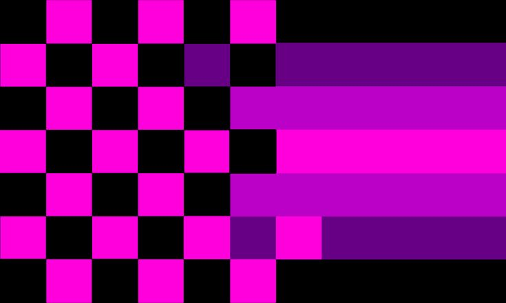
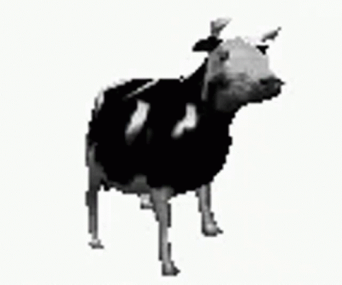

<table>
  <tr>
    <td width="40%" align="center">
      
    </td>
    <td width="60%" valign="middle" style="padding-left: 20px;">
      <h3>// Open Source & Tools</h3>
      
Subiendo código abierto y compartiendo herramientas y utilidades orientadas a la automatización y el desarrollo Hablame.

    </td>
  </tr>
</table>

<h3>// Experimental & Lab</h3>

Prototipando y probando scripts. Documentando hallazgos en repositorios públicos.

<h3>// Contact</h3>

Abierto a colaboración técnica y discusión de proyectos.

<b>User:</b> _1.16.5

